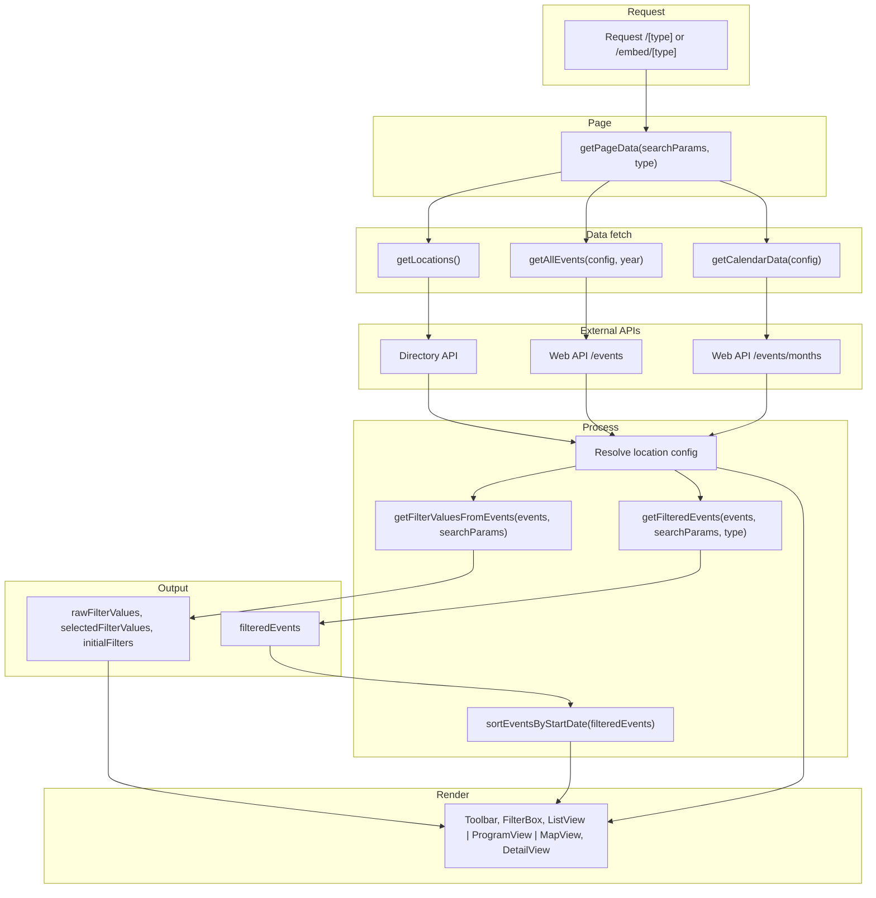

# PLN Events – Technical Documentation

Technical reference for developers joining the **pln-events** project. This document describes the stack, structure, environment, and main flows so you can run, navigate, and extend the codebase.

---

## 1. Project overview

**pln-events** is a Next.js application that lists and displays events for Protocol Labs. Users can browse events by **list**, **program** (calendar), or **map**, filter by location, year, date range, hosts, event type, and topics, and open event details in a modal. An **embed** variant of the same views is available without the main site header.

- **Product name (UI):** PL Events  
- **Package name:** `pl-events`  
- **Repository:** Single Next.js app (App Router), TypeScript, React 18.

---

## 2. Tech stack

| Layer        | Technology |
|-------------|------------|
| Framework   | Next.js 14 (App Router) |
| UI          | React 18, TypeScript |
| Styling     | CSS Modules (`.module.css`), styled-jsx, global `globals.css` |
| Maps        | Leaflet, react-leaflet, leaflet.markercluster |
| Calendar    | FullCalendar, Schedule-X (@schedule-x/*) |
| Dates       | moment-timezone |
| Analytics   | PostHog (posthog-js) |
| Other UI    | react-toastify, react-responsive-carousel, @preact/signals |
| Testing     | Jest, @testing-library/react, @testing-library/jest-dom, @testing-library/user-event |
| Lint        | ESLint (eslint-config-next) |
| Build       | Next.js (webpack); SVGs via @svgr/webpack |

---

## 3. Repository structure

```
pln-events/
├── app/                    # App Router: layouts, pages, API routes
│   ├── layout.tsx          # Root layout (header, PostHog, banner, main)
│   ├── page.tsx            # Home (redirect target)
│   ├── globals.css
│   ├── registry.tsx        # Styled-jsx registry
│   ├── [type]/page.tsx     # Main app: list | program | map
│   ├── embed/[type]/page.tsx  # Embed: same views, no header
│   └── api/
│       ├── events/route.ts    # GET: events from content/events JSON
│       ├── eventjson/route.ts # GET: same JSON (alias)
│       └── revalidate/route.ts# POST: revalidate cache by tags (auth)
├── components/
│   ├── core/               # Header, filter box, tabs, PostHog, announcement
│   ├── page/               # Toolbar, list view, program view, map view, detail popup, legends
│   ├── ui/                 # Shared UI (e.g. events-no-results)
│   └── embed/              # Embed-specific (e.g. URL sync)
├── service/
│   └── events.service.ts   # Data layer: events API, calendar, locations, banner, filters
├── utils/
│   ├── constants.ts        # URL separator, years, months, colors, view types, etc.
│   └── helper.ts           # Dates, slugs, filter helpers, formatting
├── types/
│   ├── events.type.ts      # IEvent, IEventResponse, IFilterValue, ISelectedItem, etc.
│   └── shared.type.ts      # IEventHost, IViewTypeMenu
├── hooks/                  # use-events-scroll-observer, use-clicked-outside, use-filter-hook, use-hash, etc.
├── analytics/              # PostHog helpers (schedule, filter, header, events)
├── schema/                 # Content/CMS schema definitions
├── content/                # content/events (JSON), themes, pages, global
├── public/                 # Icons, images, uploads, logos, admin, ipfs-404.html
├── eventTemplate/          # Template for new event JSON (see README)
├── middleware.ts           # Sets x-hide-header for /embed
├── next.config.js
├── tsconfig.json           # Path alias: @/* → root
├── jest.config.js
├── jest.setup.js
└── __tests__/              # Component tests (mirrors components/)
```

---

## 4. Getting started

### Prerequisites

- Node.js (LTS recommended)
- Yarn

### Install and run

```bash
yarn install
yarn dev
```

- Dev server: typically `http://localhost:3000`  
- Root `/` redirects to `/map`.

### Build and start (production)

```bash
yarn build
yarn start
```

### Lint and test

```bash
yarn lint
yarn test
yarn test:watch      # Watch mode
yarn test:coverage   # Coverage report
```

Tests live under `__tests__/` and mirror `components/`. Jest uses `next/jest`, path alias `@/`, and `jest.setup.js` for router/navigation and browser API mocks.

---

## 5. Environment variables

Configure a `.env` file at the project root. Below are all variables referenced by the application.

| Variable | Used in | Purpose |
|----------|---------|---------|
| `NEXT_PUBLIC_ANNOUNCEMENT_API_URL` | service | Announcement banner API base URL |
| `NEXT_PUBLIC_ANNOUNCEMENT_API_TOKEN` | service | Authorization for announcement API |
| `NEXT_PUBLIC_BASE_URL` | service | App base URL (e.g. for internal API calls) |
| `NEXT_PUBLIC_IRL_URL` | app-header | Link for “IRL” / attendees button |
| `NEXT_PUBLIC_POSTHOG_KEY` | posthog-provider | PostHog project key |
| `NEXT_PUBLIC_POSTHOG_HOST` | posthog-provider | PostHog API host (e.g. https://app.posthog.com) |
| `NEXT_PUBLIC_REVALIDATE_TOKEN` | api/revalidate | Bearer token for POST /api/revalidate |
| `ALLOWED_IMAGE_DOMAINS` | next.config | Comma-separated domains for next/image |
| `WEB_API_BASE_URL` | service, next.config | Events/calendar API base URL |
| `WEB_API_TOKEN` | service, next.config | Bearer token for events/calendar API |
| `ORIGIN_DOMAIN` | service, next.config | Origin header sent to events/calendar API |
| `DIRECTORY_API_URL` | service | Directory API base (e.g. …/v1/internals/irl/locations) |
| `DIRECTORY_API_TOKEN` | service | Bearer token for directory API |
| `EVENT_AGENDA_REFRESH_URL` | service, next.config | Base URL for agenda refresh (e.g. …/api/event/:id) |
| `EVENT_CLIENT_SECRET` | next.config | Exposed to server for event-related calls |
| `SUBMIT_EVENT_URL` | app-header, events-no-results, next.config | “Submit event” link URL |
| `REFRESH_DISABLED_EVENTS` | utils/helper | Comma-separated list (refresh logic) |
| `REFRESH_ENABLED_EVENTS` | utils/helper | Comma-separated list (refresh logic) |
| `AUTH_API_BASE_URL` | .env.example only | Auth API (add if used) |
| `AUTH_APP_CLIENT_ID` | .env.example only | Auth app client ID (add if used) |
| `AUTH_APP_CLIENT_SECRET` | .env.example only | Auth app client secret (add if used) |

**Revalidate API:** The route checks the `Authorization: Bearer <token>` header against `NEXT_PUBLIC_REVALIDATE_TOKEN`. Ensure this value is set in `.env` for server-side use.

---

## 6. Application architecture

### Entry and layout

- **Root layout** (`app/layout.tsx`): Loads Inter font, metadata, PostHog provider, styled-jsx registry. Fetches announcement banner data, reads `x-hide-header` (set by middleware for `/embed`), and conditionally renders `AppHeader`. Renders `children` inside `<main>`.

### Routes

| Path | Description |
|------|-------------|
| `/` | Redirects to `/map` (next.config redirect) |
| `/[type]` | Main app: `type` = `list` \| `program` \| `map`. Filter box + toolbar + list/program/map view + detail modal + legends. |
| `/embed/[type]` | Same views as above; header hidden via middleware; embed-specific URL sync. |

### Middleware

`middleware.ts` runs on each request. For paths starting with `/embed`, it sets response header `x-hide-header: true`; otherwise `x-hide-header: false`. The root layout uses this to show or hide the main header.

### Flow chart

Main view data flow (list / program / map and embed):



### API routes

| Method | Path | Auth | Description |
|-------|------|------|-------------|
| GET | `/api/events` | — | Reads all JSON files from `content/events`, returns `{ data: [...] }`. |
| GET | `/api/eventjson` | — | Same as `/api/events`. |
| POST | `/api/revalidate` | Bearer token (`NEXT_PUBLIC_REVALIDATE_TOKEN`) | Body: `{ tags: string[] }`. Calls Next.js `revalidateTag(tag)` for each tag. Returns 401 if token missing/invalid, 400 if `tags` is not an array. |

---

## 7. Key modules

### Service (`service/events.service.ts`)

- **getBannerData()** – Fetches announcement data (uses `NEXT_PUBLIC_ANNOUNCEMENT_API_URL` / `NEXT_PUBLIC_ANNOUNCEMENT_API_TOKEN`).
- **getAllEvents(location, year)** – Fetches and formats events from the web API; supports location and year filters.
- **getCalendarData(location)** – Fetches month-level calendar data from the web API.
- **getLocations()** – Fetches locations from the directory API and returns a keyed record.
- **getFilterValues()** – Builds filter config from events and selected state (legacy-style filter shape).
- **getUniqueValuesFromEvents()** – Extracts unique years, locations, hosts, topics from events.
- **getFilteredEvents()** – Filters events by selected filters (year, location, date range, hosts, type, topics, etc.).
- **getRefreshedAgenda(eventId)** – Fetches updated agenda for an event from `EVENT_AGENDA_REFRESH_URL`.
- **getFormattedEvents()** – Maps raw API event shape to app event shape (dates, hosts, contacts, logos, slugs, etc.).

All web API calls use server-side env vars (`WEB_API_BASE_URL`, `WEB_API_TOKEN`, `ORIGIN_DOMAIN`, `DIRECTORY_API_*`, etc.).

### Utils

- **utils/constants.ts** – URL separator, years, months, event types, view types, colors, calendar legends, access types, tags, etc.
- **utils/helper.ts** – `stringToSlug`, `formatDateTime`, `formatDateForSchedule`, `formatDateForDetail`, `getTime`, `getUTCOffset`, `getFilterValuesFromEvents`, `getFilteredEvents`, `sortEventsByStartDate`, and other date/filter helpers. Uses `REFRESH_DISABLED_EVENTS` / `REFRESH_ENABLED_EVENTS` where applicable.

### Types

- **types/events.type.ts** – `IEvent`, `IEventResponse`, `IFilterValue`, `ISelectedItem`, `IMonthwiseEvent`.
- **types/shared.type.ts** – `IEventHost`, `IViewTypeMenu`.

### Components

- **core** – App header (nav, IRL link, submit event link), filter box, tabs, PostHog provider, announcement banner.
- **page** – Toolbar (view switch, location/year/filters, calendar), list view, program view (Schedule-X/FullCalendar), map view (Leaflet + clustering), event detail popup, legends modal.
- **embed** – URL sync with embed query params.
- **ui** – Shared pieces (e.g. events-no-results with submit-event link).

### Hooks and analytics

- **hooks/** – Scroll observer, outside-click, escape key, filter state, hash. Used by list, filters, and modals.
- **analytics/** – PostHog helpers for schedule, filter, header, and events.

---

## 8. Styling conventions

- **BEM-like naming:** Use a single block for a section and nested elements with `__` (e.g. `parent`, `parent__child1`, `parent__child1__grandChild`, `parent__child2`).
- **Page-level styles:** Use CSS Modules (e.g. `page.module.css`) for route/page-specific layout and spacing.
- **Component-level styles:** Use styled-jsx inside components where appropriate. The root layout wraps the app in `StyledJsxRegistry`.
- **Global styles:** `app/globals.css` and any global overrides; layout uses a root class (e.g. `applayout`, `applayout__header`, `applayout__main`).

---

## 9. Next.js configuration

- **Images:** `images.domains` is driven by `ALLOWED_IMAGE_DOMAINS` (comma-separated).
- **SVG:** Webpack rule for `.svg` in `.tsx`/`.jsx` via `@svgr/webpack` (import SVGs as components).
- **Env:** Selected server-side env vars are passed through `next.config.js` `env` (e.g. `WEB_API_BASE_URL`, `WEB_API_TOKEN`, `ORIGIN_DOMAIN`, `SUBMIT_EVENT_URL`, `EVENT_AGENDA_REFRESH_URL`, etc.).
- **Rewrites:** `/` → `/index`, `/admin` → `/admin/index.html`.
- **Redirects:** `/` → `/map` (non-permanent).

---

## 10. Testing

- **Runner:** Jest with `next/jest` and `jest-environment-jsdom`.
- **Path alias:** `@/` mapped to project root in Jest.
- **Setup:** `jest.setup.js` mocks Next router/navigation, `matchMedia`, `IntersectionObserver`, `ResizeObserver`, and extends expect with `@testing-library/jest-dom`.
- **Tests:** Under `__tests__/`, mirroring `components/` (e.g. core, page/events, page/list, page/event-detail, page/filter, ui, registry).
- **Coverage:** `collectCoverageFrom` includes components, app, hooks, utils, service; excludes types, schema, public, api routes, layout, page components, and posthog-provider.

Run: `yarn test`, `yarn test:watch`, `yarn test:coverage`.

---

## 11. Event content (JSON)

Event data for the **main list/program/map views** comes from the **web API** (`getAllEvents`), not from the repo’s JSON files. The repo also contains:

- **content/events/*.json** – JSON files that are served by `GET /api/events` and `GET /api/eventjson` for other consumers or tooling.
- **eventTemplate/template_short_event.txt** – Human-readable template describing the shape and fields expected for event JSON. The main README explains how to add a new event (template, path, PR flow).

If you work on features that consume `/api/events` or `/api/eventjson`, use the template and existing JSON files in `content/events` as the schema reference.

---

## 12. Quick reference

- **Add a new view type:** Extend `[type]` and embed routing and toolbar; add a view component and route segment.
- **Change filters:** Adjust `getFilterValuesFromEvents` / `getFilteredEvents` in `utils/helper.ts` and filter config in `service/events.service.ts` / `utils/constants.ts`.
- **New env var:** Add to `.env`, and if needed to `next.config.js` `env` for server use. Only `NEXT_PUBLIC_*` are exposed to the client.
- **Revalidate cache:** Call `POST /api/revalidate` with `Authorization: Bearer <NEXT_PUBLIC_REVALIDATE_TOKEN>` and body `{ "tags": ["tag1", "tag2"] }`.

For product and contribution workflow (e.g. submitting events via PR), see the main **README.md**.
