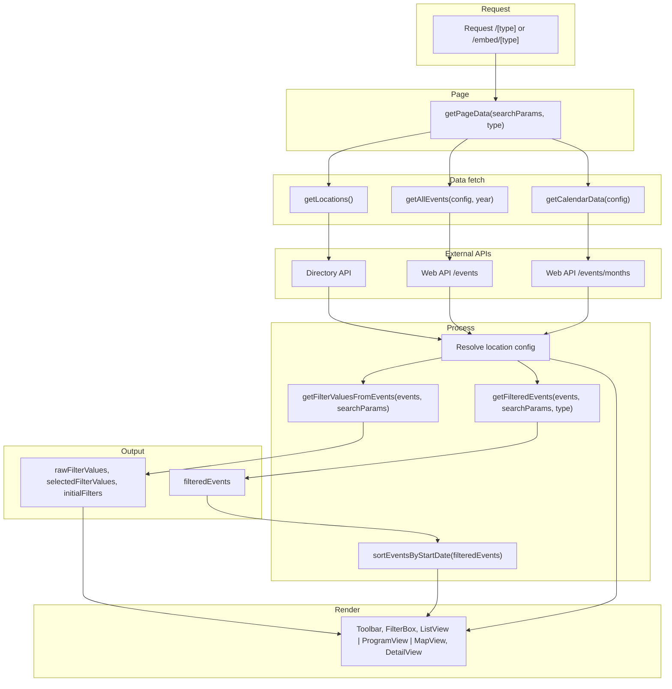

# PLN Events – Technical Documentation

**Repository**: [https://github.com/memser-spaceport/pln-events.git](https://github.com/memser-spaceport/pln-events.git)

## Table of contents

1. [Project overview](#1-project-overview)
2. [Tech stack](#2-tech-stack)
3. [Repository structure](#3-repository-structure)
4. [Getting started](#4-getting-started)
5. [Environment variables](#5-environment-variables)
6. [Application architecture](#6-application-architecture)
7. [Key modules](#7-key-modules)
8. [Styling conventions](#8-styling-conventions)
9. [Next.js configuration](#9-nextjs-configuration)
10. [Testing](#10-testing)
11. [Event content (JSON)](#11-event-content-json)
12. [Quick reference](#12-quick-reference)

---

## 1. Project overview

pln-events is a Next.js application that lists and displays events for Protocol Labs. Users can browse events by list, program (calendar), or map, filter by location, year, date range, hosts, event type, and topics, and open event details in a modal. An embed variant of the same views is available without the main site header. **Live site url:** [https://events.plnetwork.io](https://events.plnetwork.io)

- **Product name (UI):** PL Events  
- **Package name:** `pl-events`  
- **Repository:** Single Next.js app (App Router), TypeScript, React 18.

---

## 2. Tech stack

| Layer        | Technology |
|-------------|------------|
| Framework   | Next.js 14 (App Router) |
| UI          | React 18, TypeScript |
| Styling     | CSS Modules (`.module.css`), styled-jsx, global `globals.css` |
| Maps        | Leaflet, react-leaflet, leaflet.markercluster |
| Calendar    | FullCalendar, Schedule-X (@schedule-x/*) |
| Dates       | moment-timezone |
| Analytics   | PostHog (posthog-js) |
| Other UI    | react-toastify, react-responsive-carousel, @preact/signals |
| Testing     | Jest, @testing-library/react, @testing-library/jest-dom, @testing-library/user-event |
| Lint        | ESLint (eslint-config-next) |
| Build       | Next.js (webpack); SVGs via @svgr/webpack |

---

## 3. Repository structure

```
pln-events/
├── app/                    # App Router: layouts, pages, API routes
│   ├── layout.tsx          # Root layout (header, PostHog, banner, main)
│   ├── page.tsx            # Home (redirect target)
│   ├── globals.css
│   ├── registry.tsx        # Styled-jsx registry
│   ├── [type]/page.tsx     # Main app: list | program | map
│   ├── embed/[type]/page.tsx  # Embed: same views, no header
│   └── api/
│       ├── events/route.ts    # GET: events from content/events JSON
│       ├── eventjson/route.ts # GET: same JSON (alias)
│       └── revalidate/route.ts# POST: revalidate cache by tags (auth)
├── components/
│   ├── core/               # Header, filter box, tabs, PostHog, announcement
│   ├── page/               # Toolbar, list view, program view, map view, detail popup, legends
│   ├── ui/                 # Shared UI (e.g. events-no-results)
│   └── embed/              # Embed-specific (e.g. URL sync)
├── service/
│   └── events.service.ts   # Data layer: events API, calendar, locations, banner, filters
├── utils/
│   ├── constants.ts        # URL separator, years, months, colors, view types, etc.
│   └── helper.ts           # Dates, slugs, filter helpers, formatting
├── types/
│   ├── events.type.ts      # IEvent, IEventResponse, IFilterValue, ISelectedItem, etc.
│   └── shared.type.ts      # IEventHost, IViewTypeMenu
├── hooks/                  # use-events-scroll-observer, use-clicked-outside, use-filter-hook, use-hash, etc.
├── analytics/              # PostHog helpers (schedule, filter, header, events)
├── schema/                 # Content/CMS schema definitions
├── content/                # content/events (JSON), themes, pages, global
├── public/                 # Icons, images, uploads, logos, admin, ipfs-404.html
├── eventTemplate/          # Template for new event JSON (see README)
├── middleware.ts           # Sets x-hide-header for /embed
├── next.config.js
├── tsconfig.json           # Path alias: @/* → root
├── jest.config.js
├── jest.setup.js
└── __tests__/              # Component tests (mirrors components/)
```

---

## 4. Getting started

### Prerequisites

- Node.js (LTS recommended)
- Yarn

### Install and run

```bash
yarn install
yarn dev
```

- Dev server: typically `http://localhost:3000`  
- Root `/` redirects to `/map`.

### Build and start (production)

```bash
yarn build
yarn start
```

### Lint and test

```bash
yarn lint
yarn test
yarn test:watch      # Watch mode
yarn test:coverage   # Coverage report
```

Tests live under `__tests__/` and mirror `components/`. Jest uses `next/jest`, path alias `@/`, and `jest.setup.js` for router/navigation and browser API mocks.

---

## 5. Environment variables

Configure a `.env` file at the project root. See [.env.example](.env.example) for all variables, generic examples, and format notes (e.g. URLs with or without trailing slash, comma-separated lists).

---

## 6. Application architecture

### Entry and layout

- **Root layout** (`app/layout.tsx`): Loads Inter font, metadata, PostHog provider, styled-jsx registry. Fetches announcement banner data, reads `x-hide-header` (set by middleware for `/embed`), and conditionally renders `AppHeader`. Renders `children` inside `<main>`.

### Routes

| Path | Description |
|------|-------------|
| `/` | Redirects to `/map` (next.config redirect). |
| `/list` | **List view** – Timeline of events in chronological order. Users scroll through event cards grouped by time; best for scanning many events in sequence. |
| `/program` | **Program (calendar) view** – Events on a calendar grid (Schedule-X / FullCalendar) by date and time; best for seeing what’s on in a given week or month. |
| `/map` | **Map view** – Geographic map (Leaflet with marker clustering). Events plotted by location; users pan/zoom and click markers for details. Default view (root redirects here). |
| `/embed/[type]` | Same three views as above (`list`, `program`, `map`); header hidden via middleware; embed-specific URL sync. |

### Middleware

`middleware.ts` runs on each request. For paths starting with `/embed`, it sets response header `x-hide-header: true`; otherwise `x-hide-header: false`. The root layout uses this to show or hide the main header.

### Flow chart

Main view data flow (list / program / map and embed):



### API routes

| Method | Path | Auth | Description |
|-------|------|------|-------------|
| GET | `/api/events` | — | Reads all JSON files from `content/events`, returns `{ data: [...] }`. |
| GET | `/api/eventjson` | — | Same as `/api/events`. |
| POST | `/api/revalidate` | Bearer token (`REVALIDATE_TOKEN`) | Body: `{ tags: string[] }`. Calls Next.js `revalidateTag(tag)` for each tag. Returns 401 if token missing/invalid, 400 if `tags` is not an array. |

---

## 7. Key modules

### Service (`service/events.service.ts`)

- **getBannerData()** – Fetches announcement data (uses `NEXT_PUBLIC_ANNOUNCEMENT_API_URL` / `NEXT_PUBLIC_ANNOUNCEMENT_API_TOKEN`).
- **getAllEvents(location, year)** – Fetches and formats events from the web API; supports location and year filters.
- **getCalendarData(location)** – Fetches month-level calendar data from the web API.
- **getLocations()** – Fetches locations from the directory API and returns a keyed record.
- **getFilterValues()** – Builds filter config from events and selected state (legacy-style filter shape).
- **getUniqueValuesFromEvents()** – Extracts unique years, locations, hosts, topics from events.
- **getFilteredEvents()** – Filters events by selected filters (year, location, date range, hosts, type, topics, etc.).
- **getRefreshedAgenda(eventId)** – Fetches updated agenda for an event from `EVENT_AGENDA_REFRESH_URL`.
- **getFormattedEvents()** – Maps raw API event shape to app event shape (dates, hosts, contacts, logos, slugs, etc.).

All web API calls use server-side env vars (`WEB_API_BASE_URL`, `WEB_API_TOKEN`, `ORIGIN_DOMAIN`, `DIRECTORY_API_*`, etc.).

### Utils

- **utils/constants.ts** – URL separator, years, months, event types, view types, colors, calendar legends, access types, tags, etc.
- **utils/helper.ts** – `stringToSlug`, `formatDateTime`, `formatDateForSchedule`, `formatDateForDetail`, `getTime`, `getUTCOffset`, `getFilterValuesFromEvents`, `getFilteredEvents`, `sortEventsByStartDate`, and other date/filter helpers. Uses `REFRESH_DISABLED_EVENTS` / `REFRESH_ENABLED_EVENTS` where applicable.

### Types

- **types/events.type.ts** – `IEvent`, `IEventResponse`, `IFilterValue`, `ISelectedItem`, `IMonthwiseEvent`.
- **types/shared.type.ts** – `IEventHost`, `IViewTypeMenu`.

### Components

- **core** – App header (nav, IRL link, submit event link), filter box, tabs, PostHog provider, announcement banner.
- **page** – Toolbar (view switch, location/year/filters, calendar), list view, program view (Schedule-X/FullCalendar), map view (Leaflet + clustering), event detail popup, legends modal.
- **embed** – URL sync with embed query params.
- **ui** – Shared pieces (e.g. events-no-results with submit-event link).

### Hooks and analytics

- **hooks/** – Scroll observer, outside-click, escape key, filter state, hash. Used by list, filters, and modals.
- **analytics/** – PostHog helpers for schedule, filter, header, and events.

---

## 8. Styling conventions

- **BEM-like naming:** Use a single block for a section and nested elements with `__` (e.g. `parent`, `parent__child1`, `parent__child1__grandChild`, `parent__child2`).
- **Page-level styles:** Use CSS Modules (e.g. `page.module.css`) for route/page-specific layout and spacing.
- **Component-level styles:** Use styled-jsx inside components where appropriate. The root layout wraps the app in `StyledJsxRegistry`.
- **Global styles:** `app/globals.css` and any global overrides; layout uses a root class (e.g. `applayout`, `applayout__header`, `applayout__main`).

---

## 9. Next.js configuration

- **Images:** `images.domains` is driven by `ALLOWED_IMAGE_DOMAINS` (comma-separated).
- **SVG:** Webpack rule for `.svg` in `.tsx`/`.jsx` via `@svgr/webpack` (import SVGs as components).
- **Env:** Selected server-side env vars are passed through `next.config.js` `env` (e.g. `WEB_API_BASE_URL`, `WEB_API_TOKEN`, `ORIGIN_DOMAIN`, `SUBMIT_EVENT_URL`, `EVENT_AGENDA_REFRESH_URL`, etc.).
- **Rewrites:** `/` → `/index`, `/admin` → `/admin/index.html`.
- **Redirects:** `/` → `/map` (non-permanent).

---

## 10. Testing

- **Runner:** Jest with `next/jest` and `jest-environment-jsdom`.
- **Path alias:** `@/` mapped to project root in Jest.
- **Setup:** `jest.setup.js` mocks Next router/navigation, `matchMedia`, `IntersectionObserver`, `ResizeObserver`, and extends expect with `@testing-library/jest-dom`.
- **Tests:** Under `__tests__/`, mirroring `components/` (e.g. core, page/events, page/list, page/event-detail, page/filter, ui, registry).
- **Coverage:** `collectCoverageFrom` includes components, app, hooks, utils, service; excludes types, schema, public, api routes, layout, page components, and posthog-provider.

Run: `yarn test`, `yarn test:watch`, `yarn test:coverage`.

---

## 11. Event content (JSON)

When the web API is used: The list, program, and map views get event data from the external web API (`WEB_API_BASE_URL`). The app calls `getAllEvents()` (and related services) to fetch and display events there. This is the source of truth for the main event listing.

When repo event data is used: The repo holds **content/events/*.json** files. These are:

- Served by **`GET /api/events`** and **`GET /api/eventjson`** for other consumers (e.g. tooling, integrations, or any client that needs the raw event JSON from this app).
- The basis for the PR-based workflow: new or updated events are added via pull requests to `content/events`; the Member Services team merges them, and the same data is then available via the app API.

Schema reference: For features that use `/api/events` or `/api/eventjson`, use [eventTemplate/template_short_event.txt](eventTemplate/template_short_event.txt) and existing files in `content/events` as the schema reference. The main [README.md](README.md) describes how to add a new event (template, path, PR flow).

---

## 12. Quick reference

- **Add a new view type:** Extend `[type]` and embed routing and toolbar; add a view component and route segment.
- **Change filters:** Adjust `getFilterValuesFromEvents` / `getFilteredEvents` in `utils/helper.ts` and filter config in `service/events.service.ts` / `utils/constants.ts`.
- **New env var:** Add to `.env`, and if needed to `next.config.js` `env` for server use. Only `NEXT_PUBLIC_*` are exposed to the client.
- **Revalidate cache:** The Revalidate cache ensures that stale cached data is refreshed by fetching the latest content from the origin (API, database, or CMS), allowing users to always see up-to-date information. It preserves the performance benefits of static generation while enabling dynamic content updates without requiring a full application rebuild or redeployment (similar to Next.js ISR or CDN cache invalidation). Whenever event data or other content changes—such as CMS updates, API modifications, or newly merged events—a `POST /api/revalidate` request should be triggered with the header `Authorization: Bearer <REVALIDATE_TOKEN>` and a request body like `{ "tags": ["tag1", "tag2"] }` This invalidates the specified cache tags and forces Next.js to refetch and regenerate only the affected pages.

For product and contribution workflow (e.g. submitting events via PR), see the main [README.md](README.md).